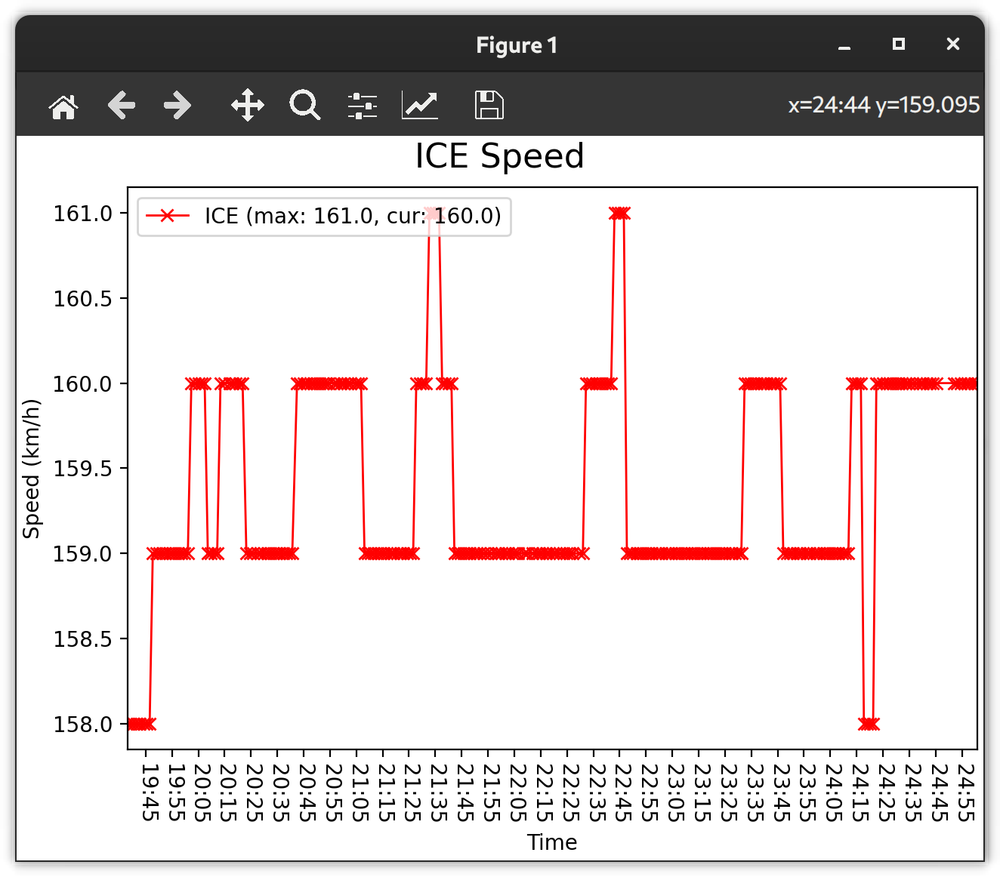

# ICE Portal Speed Plot
Python script plotting the current train speed with data from the ICE Portal.
Uses the data provided by `https://www.iceportal.de/api1/rs/status`.

## Executing:
```bash
python speed.py
```

## Example

